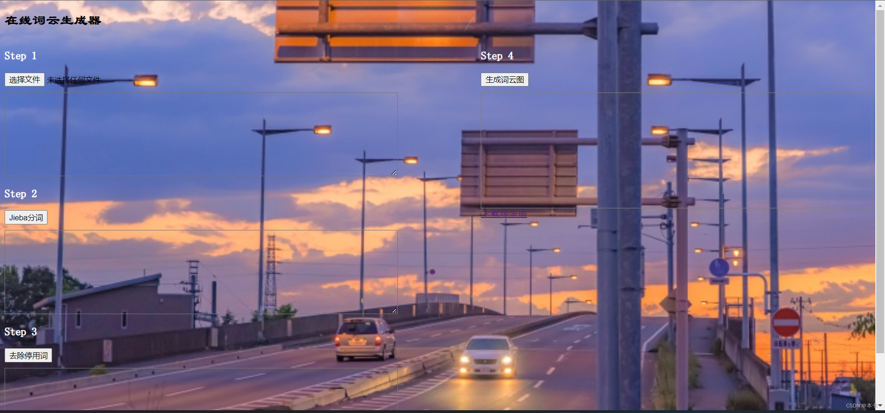
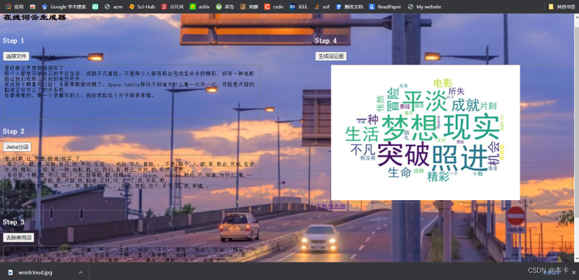
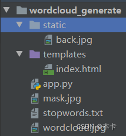

# wordcloud-website
Use python to customize a word cloud graph to generate a website
## 数据可视化——借助python自定义一个词云图生成网站

> 整体代码由flsk+html组成。flask的相关用法大家可以参考[欢迎来到Flask的世界](https://dormousehole.readthedocs.io/en/latest/)。html的用法太多，这里就不赘述了。
> 主要是我们这学期学习了数据可视化的内容，词云图生成网站是这门课上的一个内容，我觉得还挺有意思的，所以写一篇总结分享一下。大家觉得有兴趣的话可以去看我们老师的书《图数据库的影视数据应用基础与示例》。该自定义生成网站主要是借鉴了我们老师的课堂教学。

### 1、网站的逻辑：选择文件——分词——去除停用词——词云图——下载词云图
实现界面如下

完成词云图结果

### 2、代码实现
代码结构：

 - app.py：flask运行文件
 - static：静态文件（包含了一个界面背景图片back.jpg）
 - templates：界面html文件夹（包含了界面设计的html文件）
 - mask.jpg：词云图形状图片
 - stopwords.txt：停用词文件夹
 - wordcloud.jpg：最后生成的词云图（未运行时不存在）



**选择文件核心代码：**
flask设置
```python
# 接收txt文件
@app.route('/upload/file', methods=['POST'])
def upload_file():
    if request.method == 'POST':
        try:
            file = request.files['file']
            content = file.read().decode("utf-8")
            return jsonify({'data': content}), 200
        except:
            return jsonify({'code': -1, 'msg': '文件上传失败!'}), 500
        finally:
            pass
```
html设置：主要是设置了选择文件那个框

```html
<div>
	<h3 style="color: white">Step 1</h3>
	<input id="file" name="file" type="file" accept="text/plain" onchange="upload(this)" />
	<textarea id="txt" class="text"></textarea>
</div>
```
**分词核心代码：**
flask部分：

```python
# jieba分词
@app.route('/cut/jieba', methods=['POST'])
def cut_jieba():
    if request.method == 'POST':
        try:
            content = request.json.get('content', None)
            segment = jieba.lcut(content)
            return jsonify({'data': segment}), 200
        except:
            return jsonify({'code': -1, 'msg': 'Jieba分词失败!'}), 500
        finally:
            pass
```
html部分：

```html
<div>
	<h3 style="color: white">Step 2</h3>
	<button onclick="cut()">Jieba分词</button>
	<textarea id="jieba" class="text"></textarea>
</div>
```
**词频统计核心代码：**
flask部分：

```python
# 去停用词
@app.route('/remove/stopwords', methods=['POST'])
def remove_stopwords():
    if request.method == 'POST':
        try:
            segment = request.json.get('segment', None)
            new_segment = [x for x in segment if x not in ['\n', ' ']]
            with open("stopwords.txt", 'r', encoding='gbk') as f:
                stopwords = f.readlines()
                stopwords = [x.strip() for x in stopwords]
            words = [x for x in new_segment if x not in stopwords]
            return jsonify({'data': words}), 200
        except:
            return jsonify({'code': -1, 'msg': '去停用词失败!'}), 500
        finally:
            pass
```

html部分：

```html
<div>
	<h3 style="color: white">Step 3</h3>
	<button onclick="remove()">去除停用词</button>
	<textarea id="stopwords" class="text"></textarea>
</div>
```

**词云图核心代码：**
flask部分：

```python
# 生成词云图
@app.route('/genetate/cloud', methods=['POST'])
def generate_cloud():
    if request.method == 'POST':
        try:
            words = request.json.get('words', None)
            mask = imread(r'mask.jpg')  # 设置词云背景图
            wordcloud = WordCloud(font_path="simhei.ttf",  # 设置字体可以显示中文
                                  background_color="white",
                                  mask=mask,
                                  scale=2,  # 缩放比例，清晰度
                                  # width=20, height=20  # 设置图片默认的大小,若有背景图片则依照背景图片大小,
                                  )
            wc = wordcloud.generate(words)
            wc.to_file("wordcloud.jpg")
            with open("wordcloud.jpg", 'rb') as f:
                image = f.read()
            image_base64 = str(base64.b64encode(image), encoding='utf-8')
            return jsonify({'data': image_base64}), 200
        except:
            return jsonify({'code': -1, 'msg': '生成词云图失败!'}), 500
        finally:
            pass
```

html部分：

```html
<div style="width: 45%">
	<h3 style="color: white">Step 4</h3>
	<button onclick="generate()">生成词云图</button>
	<div style="width: 100%; min-height: 200px; border: 1px solid gray; margin-top: 10px">
	
	</div>
	<a href="/wordcloud.jpg">下载词云图</a>
</div>
```
**下载词云图：**

```python
# 下载词云图
@app.route("/<filename>", methods=['GET'])
def download_file(filename):
    # 需要知道2个参数, 第1个参数是本地目录的path, 第2个参数是文件名(带扩展名)
    directory = os.getcwd()  # 假设在当前目录
    return send_from_directory(directory, filename, as_attachment=True)
```
html部分：

```html
<a href="/wordcloud.jpg">下载词云图</a>
```

### 3、其他细节
**自定义背景：**
在html定义中加上背景设置类型。
```html
<style>
	.xue {
			background-image: url("../static/back.jpg");## 自定义背景
			background-repeat:no-repeat;
			background-size: 100% 100%;
         }
</style>
```

完整代码可以可在GitHub网站查看
